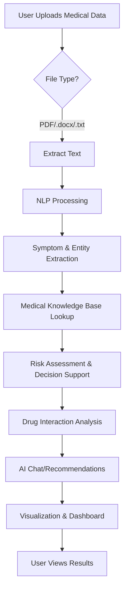
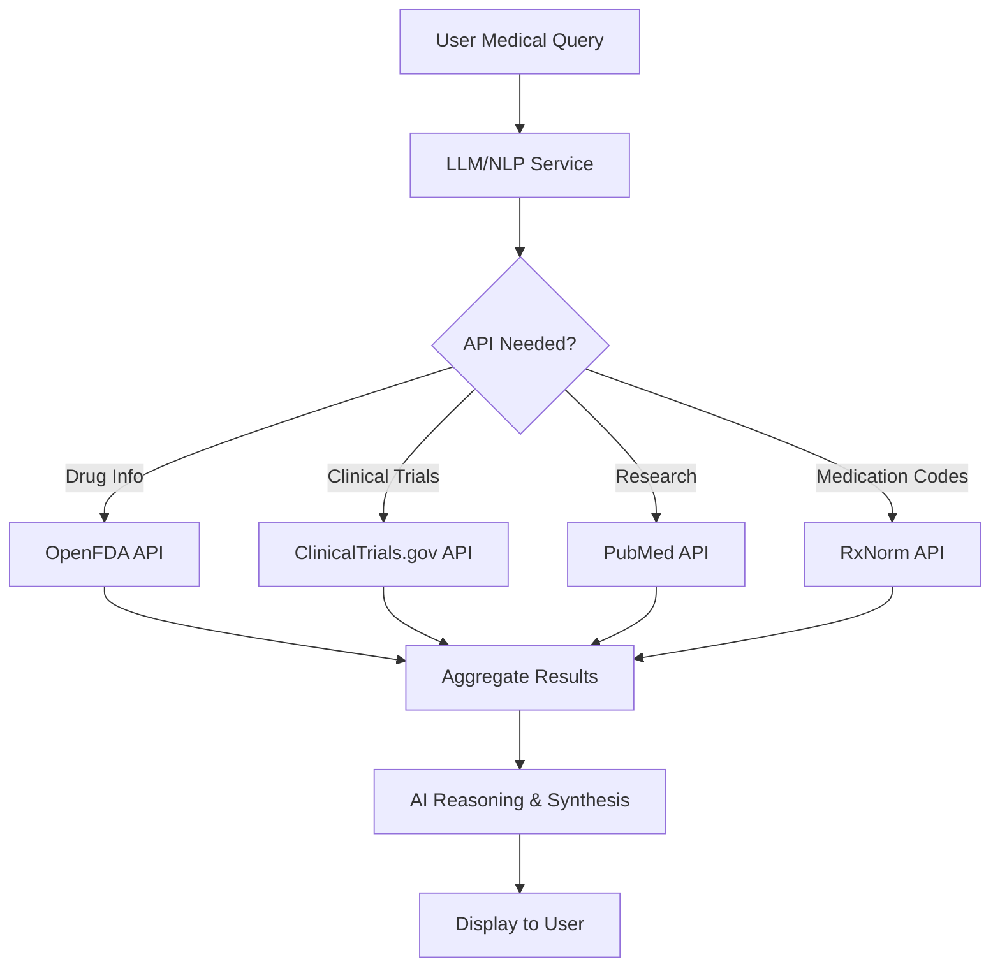

# MedAssist AI - Healthcare Intelligence Platform

MedAssist AI is a comprehensive healthcare-focused application that leverages NLP, LLM, and AI technologies to demonstrate advanced techniques commonly used in the medical, healthcare, and pharmaceutical domains.

## Key Features & AI Techniques

### 1. Natural Language Processing (NLP)
- Symptom extraction from natural language input
- Medical entity recognition for keywords and terms
- Text preprocessing and tokenization for medical queries

### 2. Large Language Model Integration
- Conversational AI assistant for medical queries
- Context-aware responses based on patient data
- Medical knowledge synthesis from structured data

### 3. Clinical Decision Support
- Risk assessment algorithm using symptoms and vital signs
- Severity scoring based on medical knowledge base
- Alert system for high-risk conditions

### 4. Drug Intelligence
- Medication interaction checker
- Pharmaceutical analysis using knowledge graphs
- Adherence tracking with smart reminders

### 5. Health Data Analytics
- Vital signs monitoring with real-time visualization
- Pattern recognition in health metrics
- Predictive risk modeling

## Technical Implementation
- React-based frontend with modern UI/UX
- In-memory medical knowledge base (expandable to real databases)
- Real-time chat interface with AI responses
- Document management system for medical records
- Interactive dashboards for health monitoring

## Healthcare-Specific AI Applications
- **Symptom Checker:** Uses NLP to parse patient descriptions
- **Drug Interaction Analysis:** Knowledge-graph based pharmaceutical intelligence
- **Risk Stratification:** ML-style scoring for patient triage
- **Clinical Documentation:** Smart forms and record management
- **Health Monitoring:** IoT-style vital signs integration

## Extensibility
The app is designed as a foundation that can be extended with:
- Real medical databases and APIs
- Advanced ML models for diagnosis prediction
- Integration with electronic health records (EHR)
- Telemedicine capabilities
- Clinical trial matching
- Medical imaging analysis

## What Was Built From Scratch
- Medical Knowledge Base: Custom symptom database, drug interactions, and condition mappings
- Risk Assessment Algorithm: Original scoring system based on symptoms + vitals
- NLP Processing Logic: Custom text parsing for medical terms and symptom extraction
- Clinical Decision Logic: Original rules for urgency classification and recommendations
- User Interface: Complete custom React components and layout
- Chat System: Built-in messaging interface with medical context awareness
- Drug Interaction Checker: Custom algorithm using knowledge base lookups

## Uses Existing Technologies
- React Framework: For UI components and state management
- Tailwind CSS: For styling (utility classes)
- Lucide React: For icons
- JavaScript: Core programming language

## What Would Need External APIs/Services in Production
For a real healthcare application, you'd typically integrate:
- FDA Drug Database API
- SNOMED CT Medical Terminology
- ICD-10 Diagnosis Codes
- RxNorm Drug Database
- Advanced NLP services (AWS Comprehend Medical, Google Healthcare NLP, Clinical BERT)
- LLM integrations (OpenAI GPT-4, Anthropic Claude, Med-PaLM)

## Enhanced Version: Real Medical API Integrations
MedAssist AI can be extended to connect with real medical APIs for production use:
- FDA OpenFDA API: Live drug information
- ClinicalTrials.gov API: Active clinical trial searches
- PubMed E-utilities API: Latest medical research
- RxNorm API: Standardized medication codes
- FHIR R4 API: Electronic Health Record data exchange
- ICD-10 & SNOMED CT: Medical coding and terminology
- HL7 Message Processing: Hospital system integration
- DICOM Medical Imaging: Medical image processing
- Computer Vision for Medical Imaging: Automated radiology analysis
- Clinical Decision Support: Risk stratification, drug interaction checking
- Natural Language Understanding: Clinical note processing, entity recognition

## Production-Ready Features
- Real API status monitoring
- Error handling and fallbacks
- HIPAA compliance considerations
- Scalable architecture patterns
- Multi-source data integration

## High-Level Workflow Diagram



## API Integration Workflow (Enhanced Version)



## Demo

You can view a live demo of the MedAssist AI application here:

[MedAssist AI Demo (Claude Server)](https://claude.ai/public/artifacts/0d3fe799-2f58-4ea3-a461-9a9f4ee2e9d7)

**Note:** This demo showcases only the graphical user interface (GUI) and includes limited features compared to the full capabilities available in the GitHub codebase. For the complete application with all features, please refer to this repository and deploy locally or to a cloud platform.

## Getting Started
1. Clone the repository:
   ```bash
   git clone https://github.com/your-username/medical-assistant-ai.git
   cd medical-assistant-ai
   ```
2. Install dependencies:
   ```bash
   npm install
   ```
3. Start the development server:
   ```bash
   npm run dev
   ```
4. (Optional) Start the backend for PDF extraction:
   ```bash
   node pdf-backend.js
   ```

## Running ML-based Medical NLP Backend

To enable advanced medical NLP fallback (ClinicalBERT):

1. Install Python dependencies:
   ```bash
   pip install flask transformers torch
   ```
2. Start the backend server:
   ```bash
   python ml_nlp_server.py
   ```
3. Ensure your React/Node.js frontend is running and can reach `http://localhost:5001/ml-nlp`.

When you ask a question not covered by the hardcoded logic, the app will automatically call the ML backend and display extracted medical entities.

## Traditional NLP Examples

This project demonstrates how to use traditional NLP techniques alongside LLMs for medical text analysis.

### Features & Examples

1. **Spelling Correction**
   - Fixes common typos in medical terms.
   - Example:
     ```python
     from nlp_traditional_examples import correct_spelling
     correct_spelling("Patient has feverr and diabtes.")
     # Output: 'Patient has fever and diabetes.'
     ```

2. **Stopword Removal**
   - Removes common English stopwords.
   - Example:
     ```python
     from nlp_traditional_examples import remove_stopwords
     remove_stopwords("Patient has a fever and diabetes.")
     # Output: 'Patient fever diabetes.'
     ```

3. **Stemming**
   - Reduces words to their root form.
   - Example:
     ```python
     from nlp_traditional_examples import stem_text
     stem_text("Patient has fevers and diabetic symptoms.")
     # Output: 'patient ha fever and diabet symptom.'
     ```

4. **Lemmatization**
   - Uses spaCy to lemmatize words.
   - Example:
     ```python
     from nlp_traditional_examples import lemmatize_text
     lemmatize_text("Patient has fevers and diabetic symptoms.")
     # Output: 'Patient have fever and diabetic symptom.'
     ```

5. **Pattern Extraction (Lab Values)**
   - Extracts lab values using regex.
   - Example:
     ```python
     from nlp_traditional_examples import extract_lab_values
     extract_lab_values("Creatinine: 1.2 Hemoglobin: 13")
     # Output: [('Creatinine', '1.2'), ('Hemoglobin', '13')]
     ```

6. **Section Detection**
   - Detects clinical note sections.
   - Example:
     ```python
     from nlp_traditional_examples import detect_sections
     detect_sections("History: ... Assessment: ... Plan: ...")
     # Output: ['History', 'Assessment', 'Plan']
     ```

---

To run all examples:
```bash
python nlp_traditional_examples.py
```

Make sure you have installed dependencies:
```bash
pip install spacy nltk
python -m spacy download en_core_web_sm
```

## Contributing
Contributions are welcome! Please open issues or submit pull requests for improvements or new features.

## License
This project is for educational and demonstration purposes. For production use, ensure compliance with healthcare regulations and data privacy standards.
